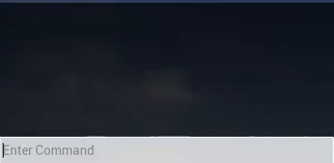

# unreal-runtime-terminal (For UE 4.27)
This is a plugin for unreal which allows users to call their methods at runtime using a terminal in order to test their features. This can be used as a quick and easy way for developers to test their newly implemented features without having to create temporary tester actors which simply invoke new methods. 

## How to install (Per project)
1) Download the [runtime terminal plugin folder](https://github.com/digocorbellini/unreal-runtime-terminal/tree/master/Plugins/DebugTerminalPlugin) found in this repo
2) Create a folder named "Plugins" in your project folder and add the `DebugTerminalPlugin` folder to said folder.
3) In the editor, choose `Editor > Plugins` to open the `Plugins` window.
4) Find the `DebugTerminalPlugin` and ensure that its `Enabled` checkbox is checked.

For more information, follow [this tutorial](https://ue4resources.com/install-plugins).

## How to use
In order to have the debug terminal visible, you must add the `MyUserWidget` widget to your desired level's viewport. This can be done in the level blueprint by constructing a new widget and adding it to the viewport on `BeginPlay`. 


Now the debug terminal should be visible on play in the top left corner of the screen:


In order to call your methods in the terminal, you must first give the debug terminal methods to call and strings to use as keys for calling said methods. This is done through calling the `MapFunction` method in the `UMyUserWidget` instance which you created and added to the viewport. I would recommend adding a reference to the `UMyUserWidget` instance in either a custom level or custom game mode class that way you can access it from any of your other actors in your project. For more information on how to pass methods to the `UMyUserWidget` class, go to the [Passing Methods To `UMyUserWidget`](https://github.com/digocorbellini/unreal-runtime-terminal/edit/master/README.md#passing-methods-to-umyuserwidget) section.

Once you have given the debug terminal a method and a string to call said method, simply type the string in the terminal and it will invoke the method at runtime.

## Passing methods to `UMyUserWidget`
In order to be able to call methods form the runtime terminal, you must first map methods to strings using the `MapFunction()` method. It takes in a string and a callback lambda. The string will be the phrase which you will type in the terminal to invoke a method at runtime, and the callback lambda will be the method to be called once you type the phrase in the terminal.

Currently, only void lambdas with no parameters are supported.

The callback lambda can be used as a standalone function to be called, as pictured below:
```C++
runtimeTerminal->MapFunction(TEXT("testPrint"), []() { GEngine->AddOnScreenDebugMessage(-1, 5, FColor::Red, TEXT("testPrint Called"));});
```

The callback lambda can also be used as a wrapper for void methods which you would like to call, as pictured below:
```C++
runtimeTerminal->MapFunction(TEXT("testPrint"), [this]() { TestPrint(); });
```

Both examples above would be invoked by the terminal in the same way:



## Goals
- [ ] Support method with return types
- [ ] Support parameter passing 
